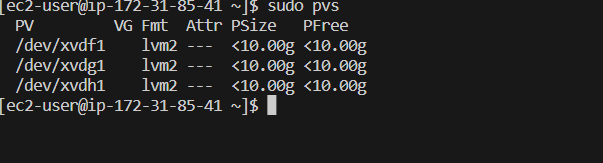

# Topic: WEB SOLUTION WITH WORDPRESS

## Objective : To Prepare Storage Infrastructure on two Linux Servers and Implement a Basic Web Solution using WordPress

## Project Flow

For this project, two EC2 instances were configured.
  
- A database server and
- A webserver that that will host the WordPress instance

The aim of this project is to connect the installed WordPress and connect it to the database server.

Also note that RedHat Linux was used to deploy this project.

## Steps

1. I Created and launched the webserver instance.

   Three EBS volumes of 10gb each was created in the same availability zone as the webserver and attached to the webserver instance.

    

2. Next step was to login to the webserver instance and configure the disk          partitions.

   I used the command below to confirm if the volumes attached above are available in our web instance.

        lsblk

    

3. After the confirmation, the next step was to partition the instance using the gdisk type of partitioning.

## Partitioning the Webserver and creating all Volumes

1. To confirm the free space on the server, the command below was used.

        df -h 

2. To create the partition on  each EBS volume, the command below was used.

        gdisk /dev/<volume-name> 

    Where volume-name is xvdf, xvdg, xvdh

    **output**
    

3. The gdisk command was repeated to create other partitions.

4. lvm2 was created with the command below

        sudo yum install lvm2
    run the command below to confirm if lvm has been created

        sudo lvmdiskscan

5. To mark my volumes as a physical volume, the command below was used

    ``````
    sudo pvcreate /dev/xvdf1 
    sudo pvcreate /dev/xvdg1
    sudo pvcreate /dev/xvdh1
    ``````

6. The command below was used to verify if the the volumes have been properly marked as a physical volume

        sudo pvs

    **output**
    

7. Next step is to create a volume group(vg) and attached same to our physical volume created above

          sudo vgcreate webdata-vg /dev/xvdh1 /dev/xvdg1 /dev/xvdf1

8. To confirm if the volume group has been successfully created the command below was used

         sudo vgs

    **output**
    

9. Next step is to create 2 logical volumes(lv), one to store the app data and the other to store the logs.
Each of the logical volumes will be assigned 14gb each.

    The command below was used to achieve this

    ``````
    sudo lvcreate -n apps-lv -L 14G webdata-vg 
    sudo lvcreate -n logs-lv -L 14G webdata-vg
    ``````

    To confirm if the lv's have been created, the command below was used

        sudo lvs

    **output**
    

    The entire setup was confirmed with:

        sudo lsblk

    

10. The next step is to format these LV to ext4 format

    ``````
    sudo mkfs -t ext4 /dev/webdata-vg/apps-lv
    sudo mkfs -t ext4 /dev/webdata-vg/logs-lv
    ``````

11. The next action point is to create the directory files to store webdata and logs respectively

    ``````
    sudo mkdir -p /var/www/html
    sudo mkdir -p /home/recovery/logs
    ``````

12. Next step is to mount the created var/www/html on apps/lv

            sudo mount /dev/webdata-vg/apps-lv /var/www/html/

       We need to backup all the log directory /var/log into /home/recovery/logs
       The command below was used to acheive this

            sudo rsync -av /var/log/. /home/recovery/logs/  

13. The next step is to mount /var/log on logs-lv logical volume with the command below

        sudo mount /dev/webdata-vg/logs-lv /var/log

14. Restore log files back into /var/log directory  with the command below

        sudo rsync -av /home/recovery/logs/. /var/log
15. Next action is to update the etc/fstab file with the UUID of our webdata-lv. This is done to ensure that the data persist even after the server is restart.

    The UUID for the lv's is obtained by using the command below

        sudo blkid

    

16. The copied UUID is step 18 is pasted into the /etc/fstab with

        sudo nano /etc/fstab

    

17. The configiration was tested with the commands below

     ``````
     sudo mount -a
     sudo systemctl daemon-reload
     ``````

18. The entire setup was confirmed with the command below

        df -h 

    

## INSTALLING AND CONFIGURING WORDPRESS ON THE WEBSERVER

After we've created our partitions, the next step is to download and configure wordpress on our webserver.

1. update the repository with the command below

        sudo yum -y update

2. Install wget, Apache and it’s dependencies

        sudo yum -y install wget httpd php php-mysqlnd php-fpm php-json
3. Start apache with the command below

        sudo systemctl enable httpd
        sudo systemctl start httpd

4. To install PHP and it’s dependencies with the commands below

        sudo yum install https://dl.fedoraproject.org/pub/epel/epel-release-latest-8.noarch.rpm
        sudo yum install yum-utils http://rpms.remirepo.net/enterprise/remi-release-8.rpm
        sudo yum module list php
        sudo yum module reset php
        sudo yum module enable php:remi-7.4
        sudo yum install php php-opcache php-gd php-curl php-mysqlnd
        sudo systemctl start php-fpm
        sudo systemctl enable php-fpm
        setsebool -P httpd_execmem 1

5. After the download, Apache is restarted with the command below

       sudo systemctl restart httpd
6. The next step is to download wordpress, to do this we need to create a folder and install all wordpress in the created folder. After download, the wordpress files are copied to the /var/www/html dir.
The commands below were used to achieve this

        mkdir wordpress
        cd   wordpress
        sudo wget http://wordpress.org/latest.tar.gz
        sudo tar xzvf latest.tar.gz
        sudo rm -rf latest.tar.gz
        cp wordpress/wp-config-sample.php wordpress/wp-config.php
        cp -R wordpress /var/www/html/

1. This step involves Configuring SELinux Policies

        sudo chown -R apache:apache /var/www/html/wordpress
        sudo chcon -t httpd_sys_rw_content_t /var/www/html/wordpress -R
        sudo setsebool -P httpd_can_network_connect=1

## Installing Mysql on the webserver and configuration

   In other to connect the database instance that will be configured once we complete the set up of the webserver, we need to install mysql-client on the instance. This is achieved my running the command below

    sudo yum install mysql

## Partitioning the Database instance and creating all Volumes

We repeat the steps for used to create, add volumes and partition the webserver.
The only difference in the setups are:

1. while creating the volume group(vg), we will create a database volume group as against webdata
    thus our lvcreate command will be

        sudo vgcreate database-vg /dev/xvdh1 /dev/xvdg1 /dev/xvdf1

2. Also, we are going to create just one logical volume

        sudo lvcreate -n db-lv -L 28G database-vg

3. Lastly, we will create /db file and not var/www/html and we mount on /db also

        mkdir -p /db
        sudo mount /dev/database-vg/db-lv /db

4. our setup can be confirmed with the command below

        df -h

    

## INSTALLING AND CONFIGURING MYSQL-SERVER ON THE DATABASE INSTANCE

 Steps:

1. update the repo and install the mysql-server using the commands below

        sudo yum update
        sudo yum install mysql-server

2. Use the command below to confirm that server is runung.

        sudo systemctl status mysql
3. To ensure the mysql starts automatically after booting our instance, use: \

        sudo systemctl enable mysql. 
4. After steps 1 to 3, we need to configure a user, create a database and configure the my sql conf file to connect to our webserver instance. The following commands are used: Rememeber to change to the mysql console.

   - To create a user, the command below was used:

          CREATE USER `myuser`@`%` IDENTIFIED BY 'mypass';

   - To create a database use the command below:
  
          CREATE DATABASE WORDPRESS;

   - Next step is to grant the created user(myuser) all access to the created database(wordpress)

            GRANT ALL ON wordpress.* TO 'myuser'@'%';
            FLUSH PRIVILEGES;

   - To confirm if the user and the database has been created, use the command below

            select user, host from mysql.user;

        

            SHOW DATABASES;

        

5. Next stop is to edit the my.cnf file and change/add the bind address

            sudo nano /etc/my.cnf

     

6. The next step is to create an inbound rule on the database instance to allow connectivity from the web instance.
  
    

7. Next step is to reload the mysql server by using the command below

        sudo systemctl restart mysqld

## CONFIGURE DATABASE AND CONNECT TO THE DATABASE FROM THE WEBSERVER INSTANCE

To enable our webserver connect to the DB instance on the web, we must configure the config.php file located on the webserver.

1. login to the webserver instance and use the command below to access the file

        sudo nano /var/www/html/wp-config.php 

2. once the config file is open, locate the database section and provide the details of the database created on our DB instance

     

3. once the database details have been inputted, use the command below to restart the httpd service with the command below.

        sudo systemctl restart httpd

    Now we can attempt to access our wordpress from the browser

            http://<public-ip-of-webserver>/wordpress

    

4. Provide the details as shown above and install wordpress.

     

## END
